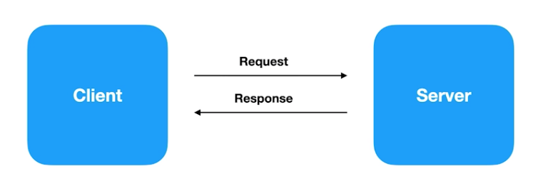
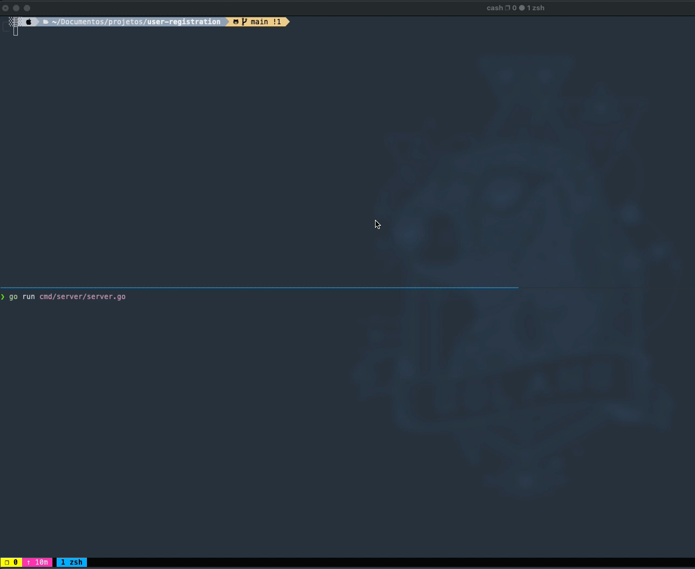
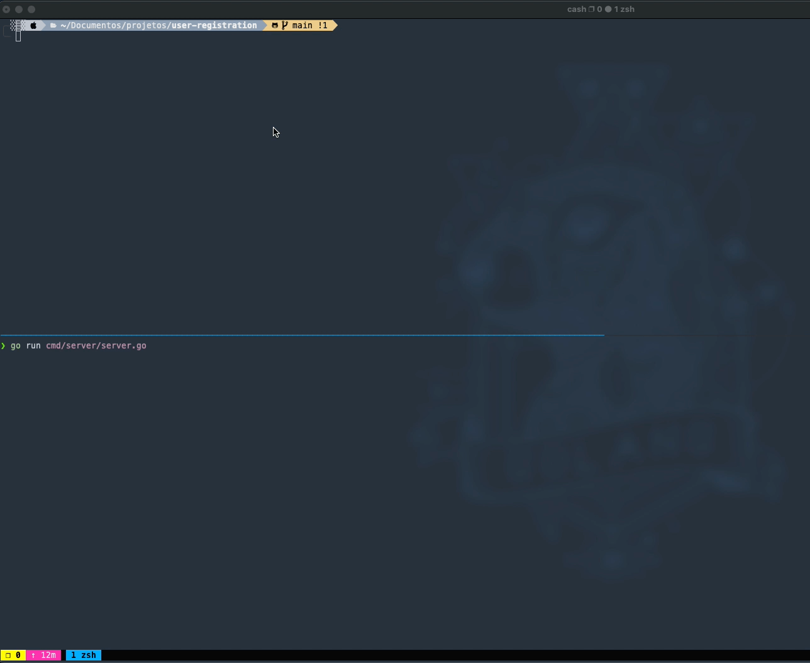

# Implementação de gRPC com GO

## Pré requisitos
- Instalar e configurar a última versão estável do [Golang](https://golang.org/dl/);
- Ler a documentação para instalar o plugin do Golang para o compilador do buffer de protocolo - [Go Generated Code](https://developers.google.com/protocol-buffers/docs/reference/go-generated);
- Instalar os plugins do [gRPC Go](https://grpc.io/docs/languages/go/quickstart/).

## gRPC GO
Esse projeto visa exemplificar de forma simples o processo de comunicação entre serviços utilizando a tecnologia gRPC com a linguagem GO;

Basicamente foram criados os exemplos abaixo:
- _API_ **_Unary_**;
- _API_ **_Server Streaming_**;
- _API_ **_Client Streaming_**;
- _API_ **_Bidirectional Streaming_**;

## Unary
API _"Unary"_ basicamente consiste em um modelo semelhante ao que estamos habituados com o _REST_:
  

- Fluxo: 
  - 
 

- Execução: 
  - 
 

## Server Streaming
API _"Server Streaming"_ tem como premissa quando um cliente faz uma requisição, o servidor dentro da _**"mesma requisição"**_ disponibiliza o retorno por etapas, não necessariamente a informação no servidor precisa estar totalmente concluída/processada para ser retornada para o cliente:
 

- Fluxo:  
  - 
 

- Execução:  
  - 
 

## Client Streaming
API _"Client Streaming"_ tem como premissa que um client pode fazer uma requisição por etapas para o servidor, não precisa necessariamente enviar a informação completa para ser processada, mantendo esse comportamente dentro da _**"mesma requisição"**_:
 

- Fluxo:  
  - 
 

- Execução:  
  - 
 

## Bidirectional Streaming
API _"Bidirectional Streaming"_ tem como premissa executar simultaneamente dentro da _**"mesma requisição"**_ o coportamente do **_Server Streaming_** e do **_Client Streaming_**:
 

- Fluxo: 
   -  
 

- Execução:  
  - 
 

## Ferramentas de testes de gRPC
- [evans gRPC](https://github.com/ktr0731/evans);
- [BloomRPC](https://github.com/uw-labs/bloomrpc).

